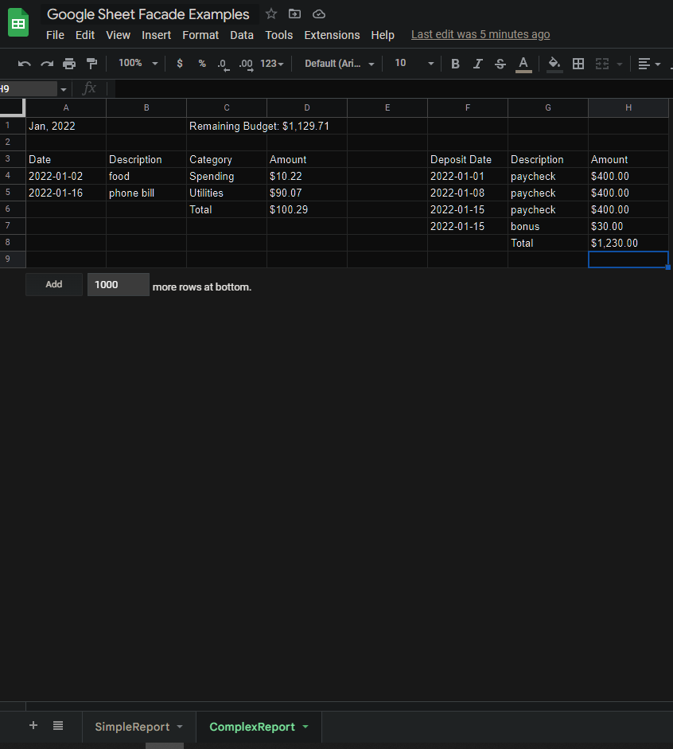

# Google Sheet Facade Library

## Why?
I found the Google api overly complex when trying to do some repetitive tasks. As a result, I created this facade
library to use in my own personal projects.

## Required Environment Variables
| Variable Name  | Description                           | Example                                      |
|----------------|---------------------------------------|----------------------------------------------|
| googleAppName  | Whatever the name is in Google        | AppName                                      |
| googleAuthJson | The JSON token used to auth to Google | {...}                                        |
| googleSheetId  | The long string id in the sheet's url | 44444ggmapJ6WHIRIfgRgk3y11111cccccbbbbbaaaaa |

### How to Use

1. Set all required environment variables.
2. Create a Google project with a name and service account.
3. Create a spreadsheet with named tabs that will be the target for reports.
4. Give the service account access to the spreadsheet. This is easily done by clicking the Share button while viewing the sheet.
5. Implement interfaces and use classes in the net.inherency.google.base package as needed.

See example uses in Main class. To run Main class:

1. Follow directions in How to Use above.
2. In the spreadsheet you create, create two tabs with the following names:
   1. SimpleReport
   2. ComplexReport
3. Run the app! If you keep the spreadsheet open in a separate screen, you can watch the changes happen in the sheet as they happen.

